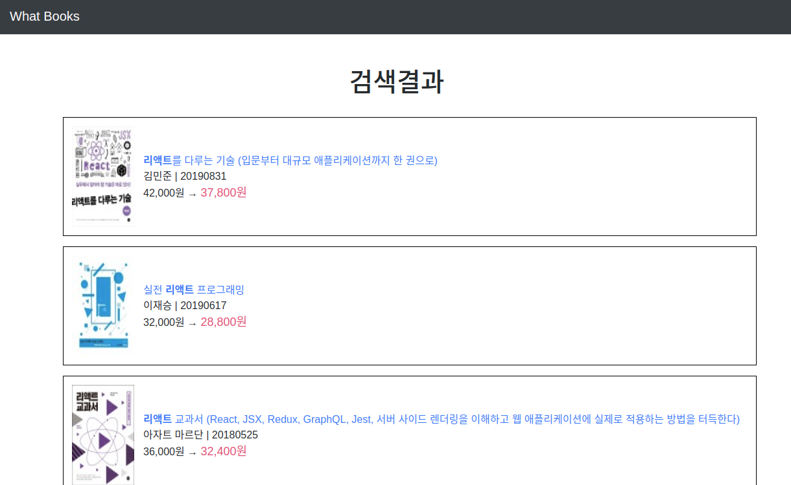

# What-Books?

## 왓츠북스 앱
네이버 API를 이용한 도서 검색 서비스

# 사용한 기술 스택
+ Python3.7, Django3.0(2.2도 무관)
+ Vanila JS
+ Bootstrap

+ 네이버 API를 호출해 데이터베이스에 저장하지 않고 그대로 랜더링
+ JS로 간단한 0글자 검색 방지 로직 구현

### 사용하기
네이버 개발홈페이지에서 API 아이디 발급 후 

__book/views.py__ 수정

        CLIENT_ID = "ID입력"
        CLIENT_SECERET = "SECRET입력"

